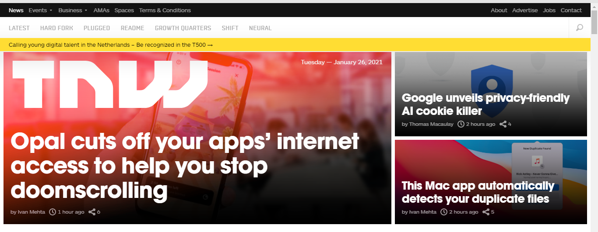
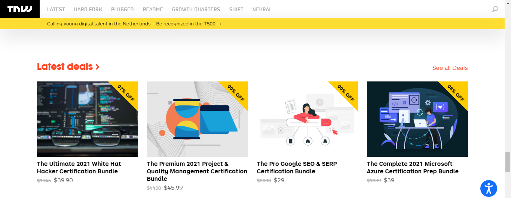
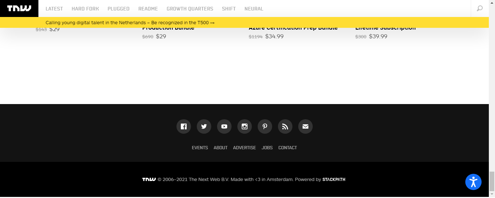

# The Next Web Clone

> This is a clone of The Next Week page.

This is the header section

This is the latest news section

This is the footer section

In this project, I am working on making the website responsive.

## Built With

- Html
- Css

## Authors

👤 **Lilian Moraa**

- GitHub: [@githubhandle](https://github.com/lily-coder)
- Twitter: [@twitterhandle](https://mobile.twitter.com/LilianM53742529)
- LinkedIn: [LinkedIn](https://www.linkedin.com/in/lilian-moraa-99950b1b8)

👤 **Anass Tantane**

- GitHub: [@githubhandle](https://github.com/Anasscodes)
- Twitter: [@twitterhandle](https://twitter.com/AnassTantane)
- LinkedIn: [LinkedIn](https://www.linkedin.com/in/anass-tantane-706172194/)

## 🤝 Contributing

Contributions, issues, and feature requests are welcome!

Feel free to check the [issues page](../../issues/).

## Show your support

Give a ⭐️ if you like this project!

## Acknowledgments

- Hat tip to anyone whose code was used
- Inspiration
- etc

## 📝 License

This project is [MIT](./MIT.md) licensed.
